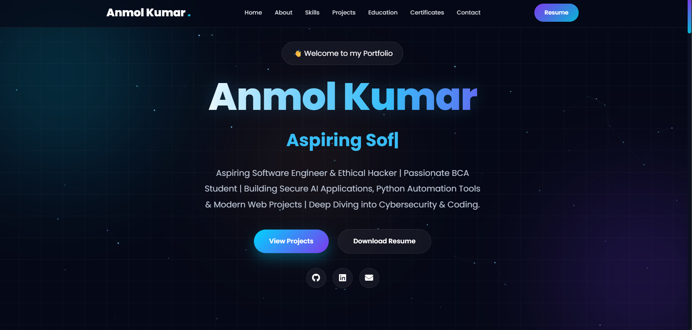
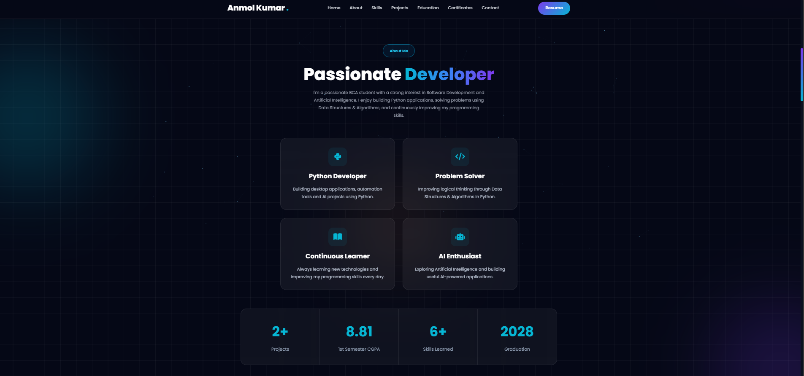
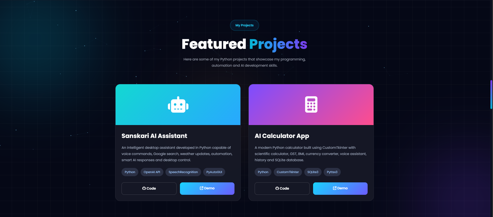
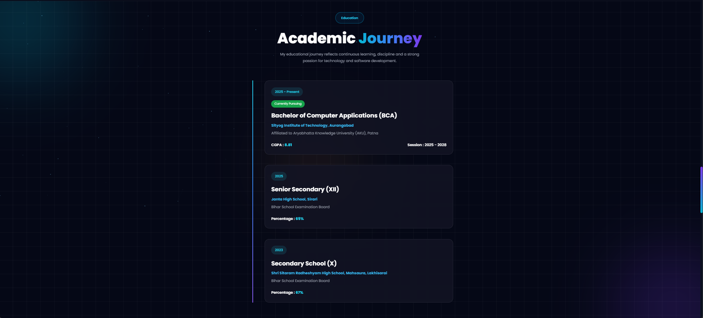

<div align="center">

# 🌐 Anmol Kumar Portfolio

### 🚀 Personal Portfolio Website

A modern, responsive, and interactive portfolio website built using **HTML, CSS, and JavaScript** to showcase my skills, projects, education, certifications, and contact information.

<br>


</div>

---

# 🌍 Live Demo

### 🔗 Portfolio Website

**https://anmolkumar108.github.io/Portfolio/**

---

# 📸 Portfolio Preview

## 🏠 Home

<p align="center">

</p>

---

## 👨 About & Skills

<p align="center">

</p>

---

## 🚀 Projects

<p align="center">

</p>

---

## 🎓 Education & Certifications

<p align="center">

</p>

---

## 📩 Contact

<p align="center">

</p>

---

# ✨ Features

- 🌟 Premium Modern UI
- 📱 Fully Responsive Design
- 🎨 Beautiful Dark Theme
- ✨ Smooth Animations
- 🖱️ Interactive Hover Effects
- 💻 About Me Section
- 📊 Skill Progress Bars
- 🚀 Featured Projects
- 🎓 Education Timeline
- 📜 Certifications
- 📩 Working Contact Form (EmailJS)
- 🌐 GitHub & LinkedIn Integration
- ⚡ Fast Loading
- 🔥 Professional Portfolio Layout

---

# 🛠️ Technologies Used

### Frontend

- HTML5
- CSS3
- JavaScript (ES6)

### Libraries

- AOS Animation
- Vanilla Tilt
- Typed.js
- GSAP
- Font Awesome
- EmailJS

---

# 📂 Folder Structure

```text
Portfolio/
│
├── assets/
│   │
│   ├── css/
│   │   ├── style.css
│   │   ├── responsive.css
│   │   ├── variables.css
│   │   └── animations.css
│   │
│   ├── js/
│   │   ├── script.js
│   │   ├── typing.js
│   │   ├── animations.js
│   │   ├── particles.js
│   │   └── cursor.js
│   │
│   ├── images/
│   │   ├── profile.png
│   │   └── preview/
│   │       ├── home.png
│   │       ├── about-skills.png
│   │       ├── projects.png
│   │       ├── education-certifications.png
│   │       └── contact.png
│   │
│   └── resume/
│       └── resume.pdf
│
├── index.html
└── README.md
```

---

# 🚀 Featured Projects

## 🤖 Sanskari AI Assistant

An advanced AI-powered desktop assistant developed using Python.

### Features

- Voice Commands
- Smart AI Responses
- Google Search
- Weather Updates
- Window Control
- Keyboard & Mouse Automation

